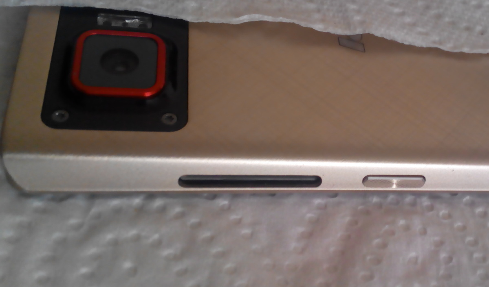
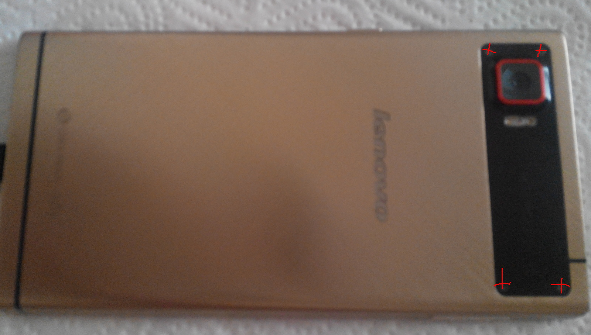
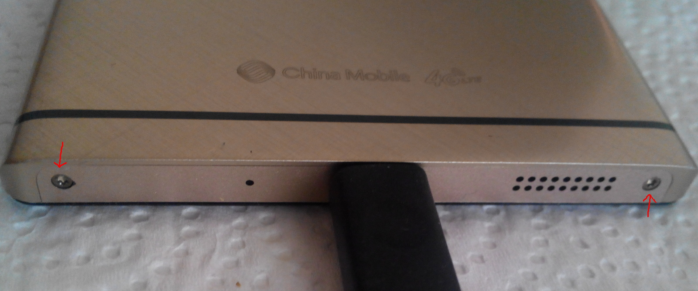
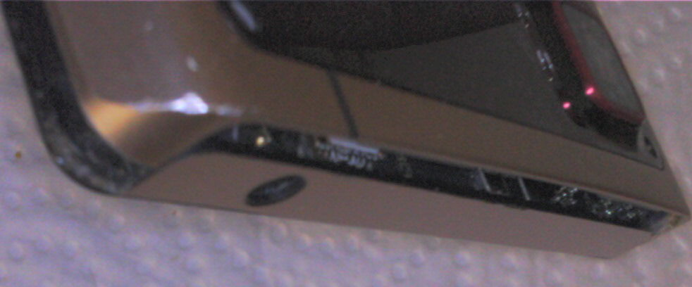
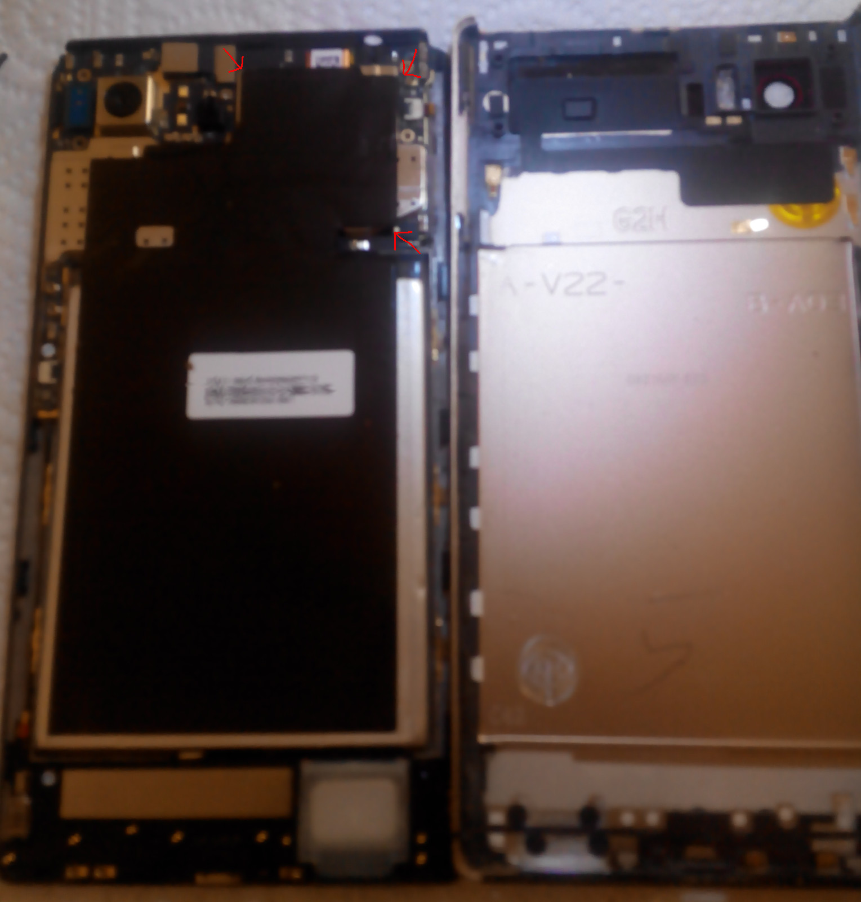
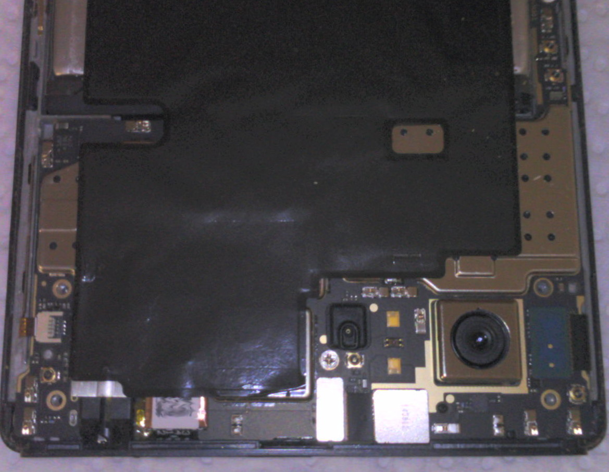
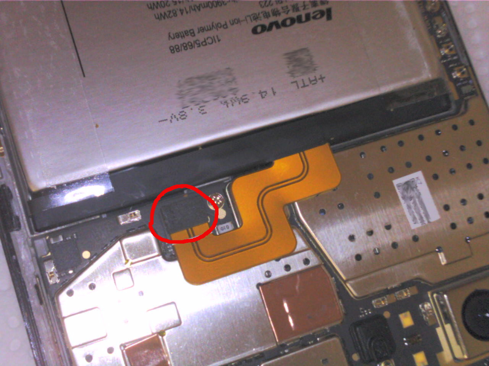
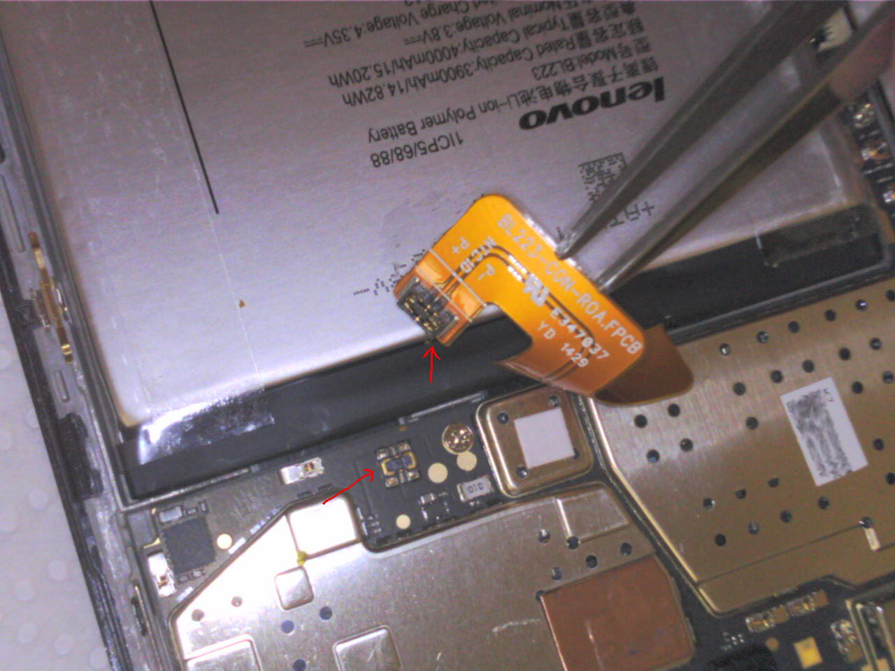
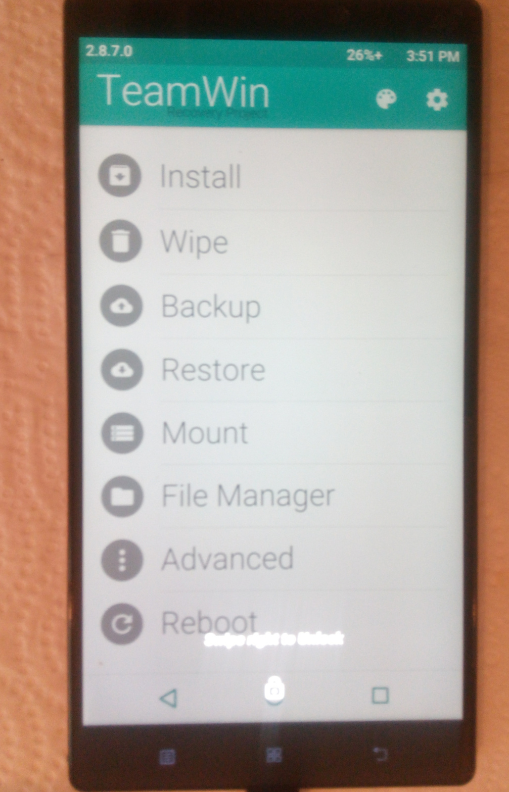

# K920HardBrickRecovery
Recover a Hard Bricked Lenovo K920

# Hard bricked ?

Sometime you just make a wrong decision and try to flash a bad rom to your phone.

On most recent qualcomm/mtk/rockchip based smartphone, it should *never* totally brick: you have always the option to boot into recovery, bootloader or factory mode.

But sometimes sh\*t really happens and you'll get a hard bricked phone: none of the those boots will work, and even you computer will not recognize your phone as a regular USB device.

It happens just to my brand new Lenovo K920, and I've the choice to:

* wait a few days so the battery is totally empty, then recharge and try to boot

* or remove the battry - BUT - it's not possible to remove the battry on this phone...wait not possible ? Here's how:

Remove the dual sim holder

Remove the four screw

Remove those 2 also

Open from the top

Here's what's inside, remove the black rubber

A close look

Pull this up, IT'S THE BATTERY !

A close look

Put every thing back to their place, hold volume - and power button, then TADA ! back to live !

Moralité : non removable battery is shit, but lenovo s\*ck less then __pomme__, because it's fun :p

